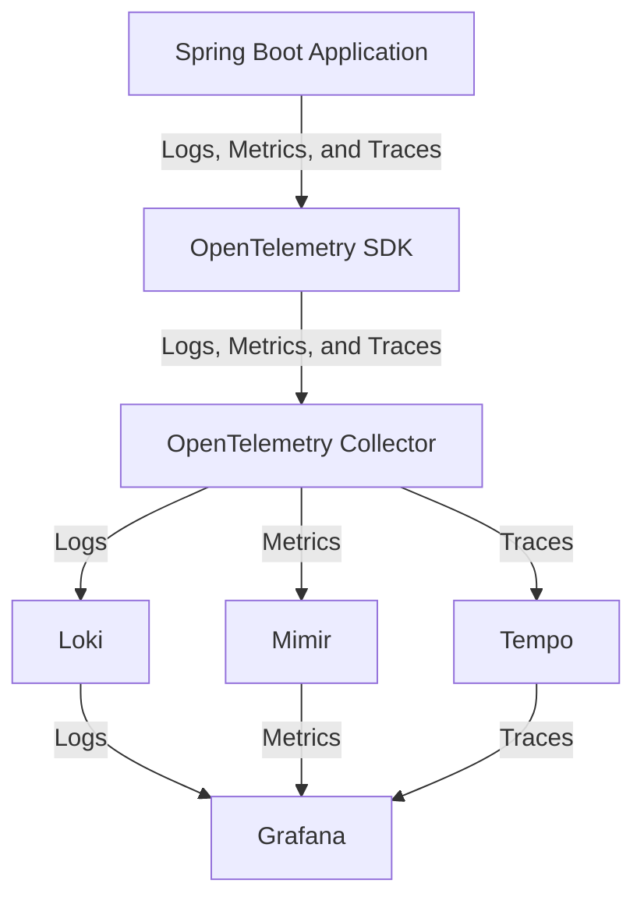

# Learn Spring OpenTelemetry with Grafana OSS

This project demonstrates how to integrate OpenTelemetry with a Spring Boot application and visualize telemetry data using Grafana OSS. It includes services for distributed tracing, metrics, and logging.

## Thoughts

I was trying to experiment with using structured logs using `logstash-logback-encoder`,
but it seems that `opentelemetry-spring-boot-starter` does not support logstash layouts yet. 
Therefore, when the Open Telemetry sdk sends the logs to the collector, the logs are using the default layout.

In my opinion, logs should be using a pull based approach anyway so this should be fine.
By pull based I mean that the logs should be written to stdout, then a log collector agent (e.g., Fluentd, Fluent Bit, or OpenTelemetry Collector)
sends the logs to the backend (e.g. Loki).

## Features

- **OpenTelemetry Integration**: Collect traces and metrics from the Spring Boot application.
- **Grafana OSS**: Visualize telemetry data.
- **Loki**: Centralized logging.
- **Tempo**: Distributed tracing.
- **Mimir**: Metrics storage and querying.
- **PostgreSQL**: Database for application data.


## Architecture


## Prerequisites

Ensure you have the following installed:

- [Docker](https://www.docker.com/)
- [Docker Compose](https://docs.docker.com/compose/)
- [Java 21](https://jdk.java.net/21/)
- [Gradle](https://gradle.org/)

## Setup Instructions

1. **Clone the Repository**:
   ```bash
   git clone https://github.com/your-repo/learn-spring-otel-grafana-oss.git
   cd learn-spring-otel-grafana-oss
   ```

2. **Start the Docker Services**:
   ```bash
   docker-compose up -d
   ```

3. **Run the Application**:
   ```bash
   ./gradlew bootRun --args='--spring.profiles.active=local'
   ```

4. **Access Grafana**:
   - Open your browser and navigate to [http://localhost:3000](http://localhost:3000).
   - Grafana is pre-configured with data sources for Loki, Tempo, and Mimir.

## Application Endpoints

- **Spend API**:
  - `POST /v1/spend`: Create a new spend record.
  - `GET /v1/spend/{id}`: Retrieve a spend record by ID.

## Configuration

### OpenTelemetry

The application is configured to export traces and metrics to the OpenTelemetry Collector. Modify the `logback-spring.xml` and `application.yaml` files to customize the telemetry settings.

### Database

The application uses PostgreSQL. Update the database connection details in `application-local.yaml` if needed.

### Docker Services

The `docker-compose.yml` file defines the following services:

- **otel-collector**: OpenTelemetry Collector for processing telemetry data.
- **grafana**: Visualization platform.
- **loki**: Centralized logging.
- **tempo**: Distributed tracing.
- **mimir**: Metrics storage.
- **db**: PostgreSQL database.

## Development

### Build the Project

Run the following command to build the project:
```bash
./gradlew build
```

### Run Tests

Execute the tests using:
```bash
./gradlew test
```

## Additional Resources

- [OpenTelemetry Documentation](https://opentelemetry.io/docs/)
- [Spring Boot Documentation](https://spring.io/projects/spring-boot)
- [Grafana Documentation](https://grafana.com/docs/)

## License

This project is licensed under the MIT License. See the LICENSE file for details.
